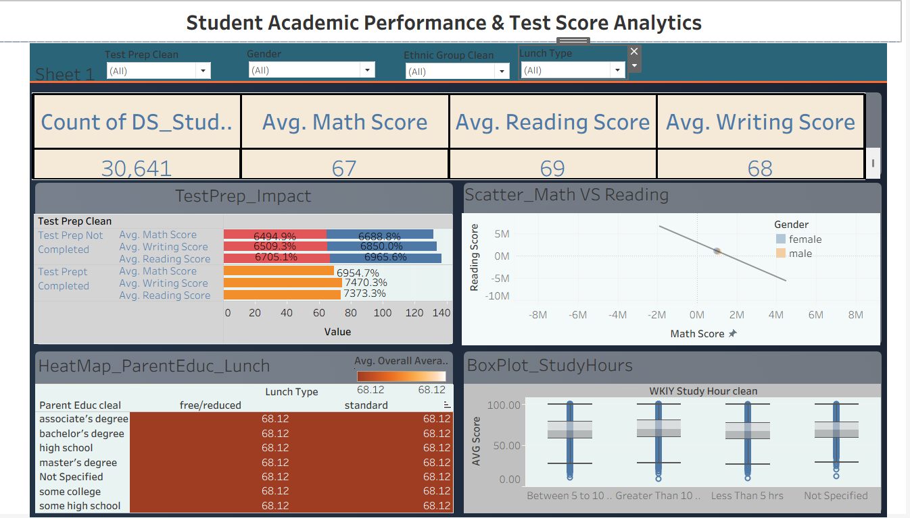

# Student Scores Analysis Dashboard – Tableau

## Project Overview

This project focuses on analyzing student performance data and creating an interactive dashboard using Tableau.

The student scores dataset was analyzed to identify patterns in student performance and present the results through interactive visualizations.

## Tools & Technologies

- Tableau
- CSV Dataset
- Data Visualization
- Data Analysis
- Dashboard Design

## Project Workflow

### 1. Data Preparation

- Imported the student scores dataset into Tableau.
- Reviewed and prepared the available fields.
- Created calculated fields for analysis.

### 2. Data Analysis

- Analyzed student scores across different categories.
- Examined the impact of test preparation on student performance.
- Analyzed student performance based on parent education and lunch type.
- Calculated overall and average student scores.

### 3. Dashboard Development

- Created an interactive Tableau dashboard.
- Used charts and visualizations to present student performance.
- Added analytical calculations and categories to improve the dashboard.
- Designed the dashboard for clear and easy interpretation.

## Dashboard

The dashboard provides a visual analysis of student performance and allows different aspects of the student scores dataset to be explored through Tableau visualizations.

## Project Files

| File | Description |
|---|---|
| `student_scores.csv` | Raw student scores dataset |
| `tableau project.twb` | Tableau workbook containing the dashboard |
| `Dashboard_Preview.png` | Preview image of the completed dashboard |

## Skills Demonstrated

- Tableau
- Data Visualization
- Data Analysis
- Dashboard Creation
- Calculated Fields
- Data Preparation

## Objective

The objective of this project was to transform student performance data into meaningful visual insights using Tableau and present the analysis through an interactive dashboard.

## Author

**Adarsh Patel**

Aspiring Data Analyst | Excel | Power BI | SQL | Python | Tableau
